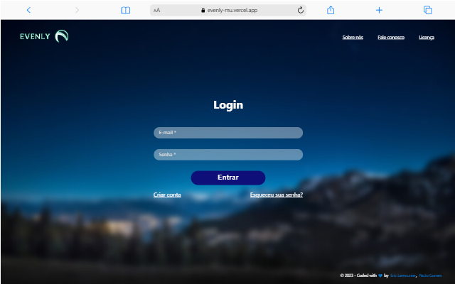
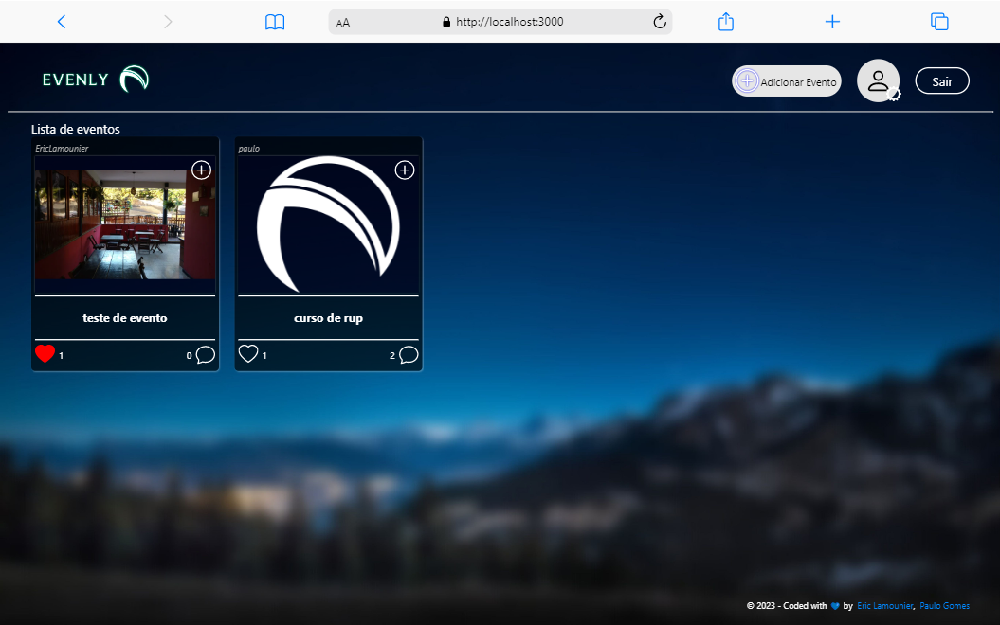

Projeto construído para a disciplina SIN143 - Laboratório de Programação, ministrada pelo professor Clausius Reis na Universidade Federal de Viçosa como trabalho final da disciplina

    
    

## Para o professor:
O projeto foi contruído utilizando as tecnologias apresentadas durante a disciplina de SIN143 - Laboratório de Programação, sendo elas:
- HTML5
- CSS3
- JavaScript
- PHP
- MySQL

Acrescido do framework ReactJS para o front-end do site, para o banco foi utilizado o MySQL da Oracle.

Para uma autenticação mais segura, utilizamos a ferramenta Firebase do Google, o qual permite guardar dados, como senhas, de maneira mais segura e prática.

A conexão entre o front-end e o banco, foi feita utilizando a linguagem PHP juntamente com o JavaScript que mandava os formulários do ReactJS para a API PHP.

Para uma maior imersão, optamos por colocar nosso site online, utilizando dois provedores:
- 000Webhost: o site do 000Webhost permite hospedar servidores Web, como o PHP e possui um banco de dados MySQL de maneira gratuita, o qual utilizamos para o projeto.
- Vercel: a plataforma Vercel permite hospedar sites Web, a utilizamos para hospedar nosso projeto, permitindo-o ficar online.
- Caso queira executá-lo diretamente em seu computador, siga os passos abaixo:

## Para acessar o site, basta clicar no link abaixo:
[Clique aqui para acessar a página](https://evenly-mu.vercel.app)

## Se preferir, execute em seu computador:
- Clone o repositório
- Executar o comando `npm install`
- Iniclizaliar o projeto ReactJS com o seguinte comando: `npm start`
- Acesse o link disponibilizado em ser terminal. Será algo como: `localhost:3000`

## Tecnologias utilizadas

- HTML5
- CSS3
- JavaScript
- ReactJS
- PHP
- MySQL
- Firebase

## Contato
eric.botelho@ufv.br

eric_lamounier@outlook.com